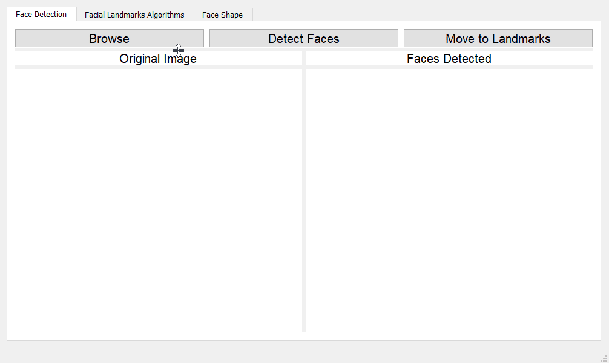

# face-Type-Classifier
- [Description](#description)
- [Test Your Face Type](#Check_Your_Face_Type)
- [Team Members](#Team_Members)
- [Run App](#Run_App)  


## Description
- Face classification is important for many applications in all fields such as:
  - Face recognition ,tracking and verification.
  - In biomedical, for cosmetics or dental reconstruction treatments or procedure.
- Our App classifies face shape into five classes (Oval ,Oblong, Square, Round).
- The app check the best fitness of your face with the five types we mentioned.
- you will see the feature according which we classified your face.
- Run the app and check for your face type 😊.

## Check_Your_Face_Type


## Team_members
| Name         |Profile|
|--------------|--------|
| Ahmed Gamil |[Ahmed-Gamil](https://github.com/Ahmed-Gamiel)|
| Mohamed mansour    | [MOHAMEDMANSOUR20](https://github.com/MOHAMEDMANSOUR20) |
| Mohamed Reda  |[mohammedreda0](https://github.com/mohammedreda0)|
| Hesham Gamal  |[heshamgamal-ui](https://github.com/heshamgamal-ui)|
| Anas Mohamed  |[Anasmaklad-web](https://github.com/Anasmaklad-web)|
| Abdelrahman Hassan  |[Abdelrahmanhassan1](https://github.com/Abdelrahmanhassan1)|
| Abdelrahman Ashraf   |[Abdelrahman-Ashraf1](https://github.com/Abdelrahman-Ashraf1)|
| Tark Salah |[tarksalah](https://github.com/tarksalah)|
| Ahmed Wael  |[Ahmedwael-afk](https://github.com/Ahmedwael-afk)|


## Run_App
```sh
python MainApplication.py
```
